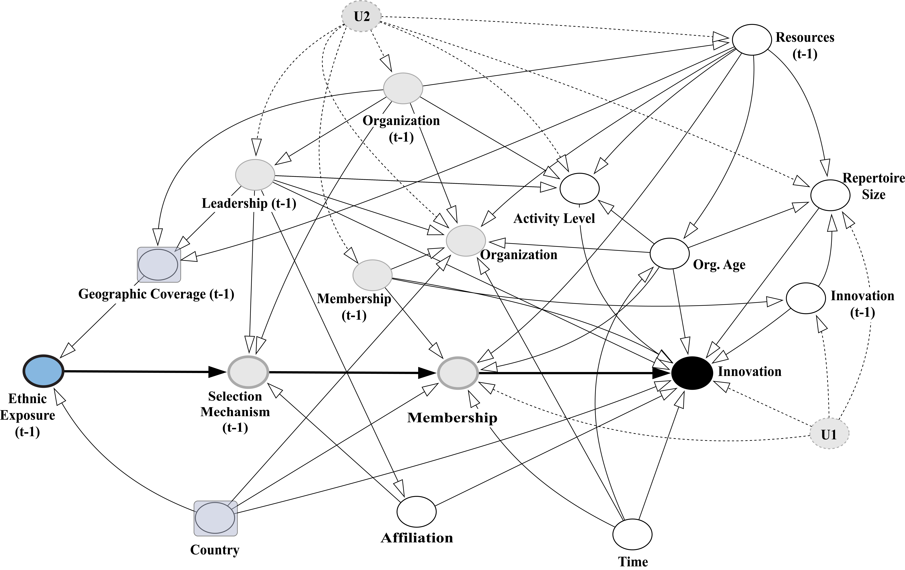

```{r setup, include=FALSE}
options(htmltools.dir.version = FALSE)
knitr::opts_chunk$set(message = F,error = F,comment = F)
require(kableExtra)
require(tidyverse)
```

.center[
### Boko Haram
 ]

--

.center[
### Abu Sayyaf
 ]


---

![:space 30]

## Why are some violent non-state actors  while others rarely change their tactical behavior?

---

## Tactical Innovation

![:space 10]


---

![:space 5]


---


---


---

![:space 10]


---


---


---

### Knowledge diversity


---

### Garbage Can Model Simulation 

![:space 12]


---

## Hypothesis 

![:space 15]

### Violent Non-State Actors with  (_those with more heterogeneous members_) will tactically  than organizations with lower levels of knowledge diverseity (_those with more homogeneous members_)

---

### Measuring incremental tactical innovations

![:space 15]


---

### Measuring incremental tactical innovations

![:space 15]


---

### Measuring incremental tactical innovations


---

### Measuring incremental tactical innovations

![:space 12]


---

### Empirical Strategy


---

### Empirical Strategy



---


### Socially-Relevant Ethnic Exposures


<!-- --- -->

<!-- ### Socially-Relevant Ethnic Exposures -->

<!--  -->

---

### Socially-Relevant Ethnic Exposures

![:space 5]


---

### Data

![:space 15]


---

### Results


---

### Results

![:space 10]


---

### Confounding Scenarios

![:space 10]


---

### Confounding Scenarios


---

### Robust to Missingness

![:space 5]


---

### Back to the Cases


.center[
#### Boko Haram &rarr; Across socio-economic and ethnic strata
 ]


.center[
#### Abu Sayyaf &rarr; Kinship Networks
 ]


---

<br>
.center[
# Thanks!
<br>
.center[
### Eric Dunford 
_McCourt School of Public Policy_<br>
**_Georgetown University_**<br>
eric.dunford@georgetown.edu<br>
[ericdunford.com](http://ericdunford.com/)

& 

Coming soon to CDS!
]
]


